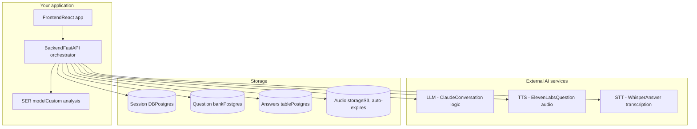

## Current Scope (v1)

| Interview Type | Question Count | Time Limit |
|---|---|---|
| Behavioral | 5 questions | 30 min |
| Technical (LeetCode-style) | 1 easy + 1 medium | 40 min |
| System Design | 1 question | 40 min |

## Session State Machine
- Session-level states
- Question-level states
- Timeout handling

## Session Data

### Config (fixed once session starts)
| Field | Example |
|---|---|
| user_id | reference to user |
| interview_type | behavioral / technical / system_design |
| company (optional) | for question retrieval |
| question_count | 5 / 2 / 1 |
| time_limit_seconds | 1800 / 2400 / 2400 |
| session_id | unique ID |

### Dynamic (changes turn-by-turn)
| Field | Purpose |
|---|---|
| current_question_index | which question you're on |
| time_elapsed_seconds | for timeout check |
| conversation_history | list of {question, answer_text, timestamp} |
| current_state | session-level state |
| current_question_state | question-level state |
| audio_refs | pointers to stored audio per answer |

## Data Retention
- Raw audio auto-expires after [X days] — privacy + storage hygiene

## System Architecture
 
### Components
 
**My application**
- **Frontend (React)** — handles login, interview/company selection, interact/submit buttons, timer display
- **Backend (FastAPI)** — single orchestrator. All requests from frontend go here first; backend is the only thing that talks to external services and the DB
- **SER model (custom)** — your own speech emotion recognition model, called after each answer to score confidence/delivery
**External AI services** (called by backend, never directly by frontend)
- **LLM (Claude)** — decides what to ask, generates follow-ups, produces end-of-session feedback
- **TTS (ElevenLabs)** — converts question text to audio
- **STT (Whisper)** — transcribes user's spoken answer to text
**Storage**
- **Session DB (Postgres)** — session state, config, conversation history
- **Question bank (Postgres)** — static reference data: company + interview type + question text
- **Audio storage (S3)** — raw audio per answer, auto-expires after retention period
### Flow summary
1. Frontend sends interview type + company to backend on Start
2. Backend queries question bank for the first question, sends text to LLM for framing, sends result to TTS → audio streamed back to frontend
3. User hits Interact (recording starts) → Submit (recording stops, audio sent to backend)
4. Backend sends audio to STT → transcribed text saved to Session DB → sent to SER model (async) → sent to LLM with conversation history for next question/follow-up
5. Loop continues until questions exhausted or timer hits the type's limit
6. On completion: LLM generates feedback from full conversation history + aggregated SER scores
### Key design decision
The backend is the **single point of contact** for the frontend — it fans out to LLM/TTS/STT/SER/DB internally. This keeps API keys server-side only and means the frontend never needs to know which third-party service is being used.
 

## Data Flow

**v1 decisions:**
- Turn-based (record → submit), not real-time streaming
- Stateful conversation (LLM sees full history within a session)
- Exact-match question retrieval (company + type), not vector search
- Emotional/delivery feedback given at end of session, not per-turn